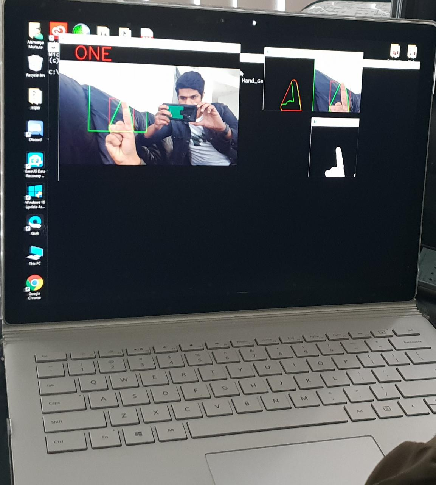

# Hand_Gesture_Recognition
**************************************************
Python 3.6 required
opencv required

Run command:

python Hand_Gesture_Ex1.py- To generate contours

python Hand_Gesture_Ex2.py- For detection
*****************************************************
Results
****************************************************
  
  

                                           
